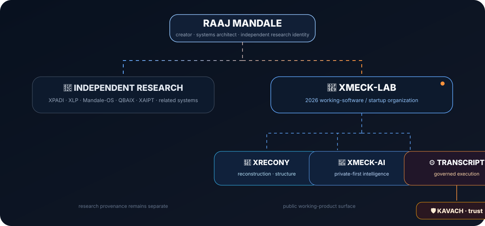
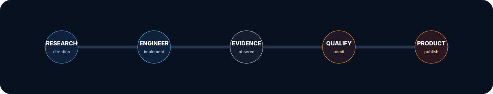

<p align="center">
  
</p>

<h1 align="center">XMECK-LAB</h1>

<p align="center">
  <b>Working software across private intelligence, data reconstruction, governed execution and trust.</b><br>
  Build → Prove → Qualify → Productize
</p>

<p align="center">
  <a href="https://github.com/XMECK-LAB/XMECK-AI"></a>
  <a href="https://github.com/XMECK-LAB/XRECONY"></a>
  <a href="https://github.com/raajmandale"></a>
</p>

<p align="center">
  <i>Working software. Explicit boundaries. Preserved provenance.</i>
</p>

---

## ⚡ What XMECK-LAB is

**XMECK-LAB** is the public working-software organization for a new product era founded by **[Raaj Mandale](https://github.com/raajmandale)**.

The organization brings together software that is being engineered around four connected concerns:

- 🧠 **Private intelligence** — useful AI workspaces where local capability, routing, authority and evidence remain visible.
- 🧬 **Data reconstruction** — understanding readable data estates before reorganizing or realizing changes.
- ⚙️ **Governed execution** — execution paths designed around explicit authority, bounded action and inspectable evidence.
- 🛡️ **Trust / protection** — protection substrates that support governed execution rather than bypassing it.

> XMECK-LAB is the **working-product surface**.  
> Raaj Mandale's older independent research programs remain preserved as research lineages and are not silently relabeled as XMECK-LAB products.

---

## 🌐 The ecosystem

<p align="center">
  
</p>

```text
Raaj Mandale
creator · systems architect · independent research identity
        │
        ├── Independent research lineage
        │   └── XPADI / XLP / Mandale-OS / QBAIX / XAIPT / related systems
        │
        └── XMECK-LAB
            ├── XRECONY
            │   └── data reconstruction / structural understanding
            │
            ├── XMECK-AI
            │   └── private-first personal intelligence workspace
            │
            └── TRANSCRIPT
                └── governed execution infrastructure
                    └── KAVACH
                        └── trust / protection substrate
```

### Identity law

| Identity | Public meaning |
|---|---|
| 👤 **Raaj Mandale** | Creator · founder · systems architect · independent research identity |
| 🧩 **XMECK-LAB** | Public software / startup organization and working-product home |
| 🧬 **XRECONY** | Reconstruction / structural-understanding product line |
| 🧠 **XMECK-AI** | Private-first personal intelligence workspace |
| ⚙️ **TRANSCRIPT** | Governed execution infrastructure |
| 🛡️ **KAVACH** | Trust / protection substrate under TRANSCRIPT |
| 🔬 **XPADI / XLP / Mandale-OS / QBAIX / XAIPT / related work** | Independent research / architecture lineage unless separately qualified and published |

---

## 🚀 Public working products

<table>
<tr>
<td width="50%" valign="top">

### 🧠 XMECK-AI

**Private-first personal intelligence workspace for Windows.**

Local intelligence · Projects / Git · Knowledge / RAG · explicit routing · governed Work · ProjectGuard · Activity / Evidence · lifecycle / recovery.

**Current public state:** engineering Founder candidate.

➡️ **[Open XMECK-AI](https://github.com/XMECK-LAB/XMECK-AI)**

</td>
<td width="50%" valign="top">

### 🧬 XRECONY

**Evidence-backed structural reconstruction for readable data estates.**

Structural views · generations · duplicate/version candidates · drift · evidence · copy-first realization.

**Current public state:** XRECONY 2.0 Public Preview.

➡️ **[Open XRECONY](https://github.com/XMECK-LAB/XRECONY)**

</td>
</tr>
</table>

---

## 🧭 Product tracks

| Track | Purpose | Public status |
|---|---|---|
| 🧠 **XMECK-AI** | Private/local intelligence workspace with governed connected capability | ✅ Public repository |
| 🧬 **XRECONY** | Data reconstruction and structural understanding | ✅ Public repository |
| ⚙️ **TRANSCRIPT** | Governed execution infrastructure | 🧪 Product publication surface pending independent qualification |
| 🛡️ **KAVACH** | Trust / protection substrate under TRANSCRIPT | 🧪 Product packaging/publication pending |

This status language is deliberate: an architecture relationship is **not** treated as proof that a separately qualified public product already exists.

---

## 🔁 From research to working software

<p align="center">
  
</p>

```text
RESEARCH
   ↓
ENGINEERING
   ↓
PHYSICAL / RUNTIME EVIDENCE
   ↓
QUALIFICATION
   ↓
PUBLIC WORKING SOFTWARE
```

XMECK-LAB preserves the difference between:

- 💡 **research direction**
- 🛠️ **engineering implementation**
- 🔬 **observed evidence**
- ✅ **qualified capability**
- 🚀 **public product surface**

That separation is part of the product discipline.

---

## 🧩 How the product lines connect

### XMECK-AI
Evolved from the **QBOX-AI** engineering lineage into the current private-first intelligence product.

### XRECONY
Carries a practical reconstruction direction associated with the broader **XPADI-SGDS** research lineage, without claiming to implement the entire XPADI architecture.

### TRANSCRIPT → KAVACH
TRANSCRIPT is the governed-execution product direction; KAVACH supplies the trust / protection substrate beneath that execution model where technically applicable.

These mappings preserve provenance without rewriting older research history.

---

## 🛡️ Engineering principles

- 🔐 **Authority before action** — capability and permission are different things.
- 🔎 **Evidence before claim** — public statements should map to observable evidence.
- 🧱 **Bounded consequence** — side effects should remain explicit and reviewable.
- 🧭 **Product truth** — `READY`, `QUALIFIED`, `HELD` and `UNAVAILABLE` are not interchangeable.
- ♻️ **Recovery as a product property** — lifecycle and recovery are designed, not bolted on.
- 👤 **User ownership** — projects, knowledge and local model assets stay under the user's control where the product says they do.
- 🧬 **Provenance preservation** — product evolution should not erase the lineage that produced it.

---

## 👤 Creator

### [Raaj Mandale](https://github.com/raajmandale)

Creator · Founder · Systems Architect · Independent Research Identity

Raaj's independent work spans AI compute, execution systems, survivability-governed data systems, authority/protection runtimes and proof-oriented engineering.

- 🌐 **Founder website:** [raajmandale.in](https://raajmandale.in)
- 💻 **GitHub:** [github.com/raajmandale](https://github.com/raajmandale)
- 🧩 **Working software:** [github.com/XMECK-LAB](https://github.com/XMECK-LAB)

> **Eranest Technoware Pvt Ltd** is Raaj Mandale's earlier company lineage.  
> **XMECK-LAB** is the newer 2026 working-software/startup organization.  
> They are not presented here as the same entity.

<details>
<summary><b>🔬 Research lineage boundary</b></summary>
<br>

Raaj Mandale's earlier and parallel research includes systems such as **XPADI-SGDS, XLP, Mandale-OS / M-OS, QBAIX, XAIPT** and related experimental/runtime work.

Those programs remain independent research/system-architecture lineages unless a specific product is explicitly admitted and published under XMECK-LAB.

This boundary prevents three common errors:

1. treating research prototypes as commercial products;
2. rewriting older work as though it was always created under XMECK-LAB;
3. turning an architectural relationship into an unsupported capability claim.

</details>

---

## 📍 Start here

| You want to… | Go to |
|---|---|
| 🧠 Explore private-first desktop intelligence | **[XMECK-AI](https://github.com/XMECK-LAB/XMECK-AI)** |
| 🧬 Explore structural data reconstruction | **[XRECONY](https://github.com/XMECK-LAB/XRECONY)** |
| 👤 Understand the creator / research lineage | **[Raaj Mandale](https://github.com/raajmandale)** |
| 🌐 See the founder website | **[raajmandale.in](https://raajmandale.in)** |

---

<p align="center">
  <b>XMECK-LAB</b><br>
  Private Intelligence · Reconstruction · Governed Execution · Trust<br><br>
  <i>Build → Prove → Qualify → Productize</i>
</p>
